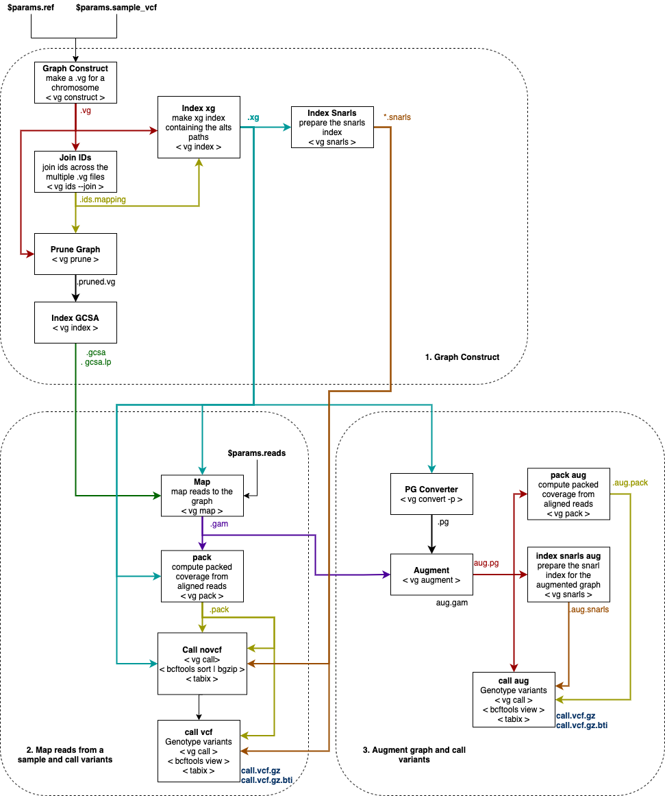

```{r include = FALSE}
knitr::opts_chunk$set(echo=FALSE)
```

```{r echo = FALSE}
source("DTable.R")
source("sanitise.R")
suppressPackageStartupMessages({
library(magrittr)
library(DT)
library(data.table)
library(htmltools)
library(stringr)
library(dplyr)
library(vcfR)
library(kableExtra)
   })
```

# Overview

<p align="center">
  
</p>

**[sv-nf](https://github.com/imendes93/sv-nf)** integrates the [vg toolkit](https://github.com/vgteam/vg) to build of a variation graph from a reference FASTA file
map reads to the graph, and call variants in a VCF file.

## sv-nf Workflow

The [sv-nf](https://github.com/imendes93/sv-nf) process is sumarized in the following diagram: 
<p align="center">
  
</p>


# Variant Calling

## Quality Control

```{r}
figure_number  <- "Figure 1: "
figure_caption <- "VCF Stats"
knitr::include_graphics(params$vcf_graph_1, )
htmltools::tags$figcaption( style = 'caption-side: bottom; text-align: center; font-size: 85%%; color: #71879d',
                            htmltools::em(figure_number),
                            htmltools::em(figure_caption))
```

## Summary

cat(readLines(params$bcf_summary), sep = '\n')
```

## Substitutions

```{r}
table   <- read.table(params$substitutions_sum, header = T, sep = ",")
DTable(table)
```

# Reference

## Graph Regerence
```{r}
figure_number  <- "Figure 2: "
figure_caption <- "Graph Reference"
knitr::include_graphics(params$graph_dot_plot, )
htmltools::tags$figcaption( style = 'caption-side: bottom; text-align: center; font-size: 85%%; color: #71879d',
                            htmltools::em(figure_number),
                            htmltools::em(figure_caption))
```

## Mapping to Graph Reference 

```{r}
figure_number  <- "Figure 3: "
figure_caption <- "Sequences mapped to graph reference"
knitr::include_graphics(params$graph_map, )
htmltools::tags$figcaption( style = 'caption-side: bottom; text-align: center; font-size: 85%%; color: #71879d',
                            htmltools::em(figure_number),
                            htmltools::em(figure_caption))
```

